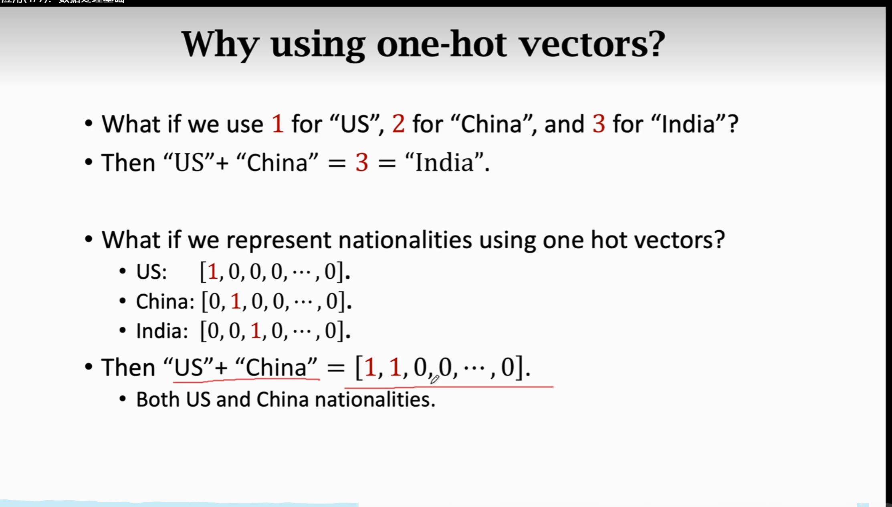
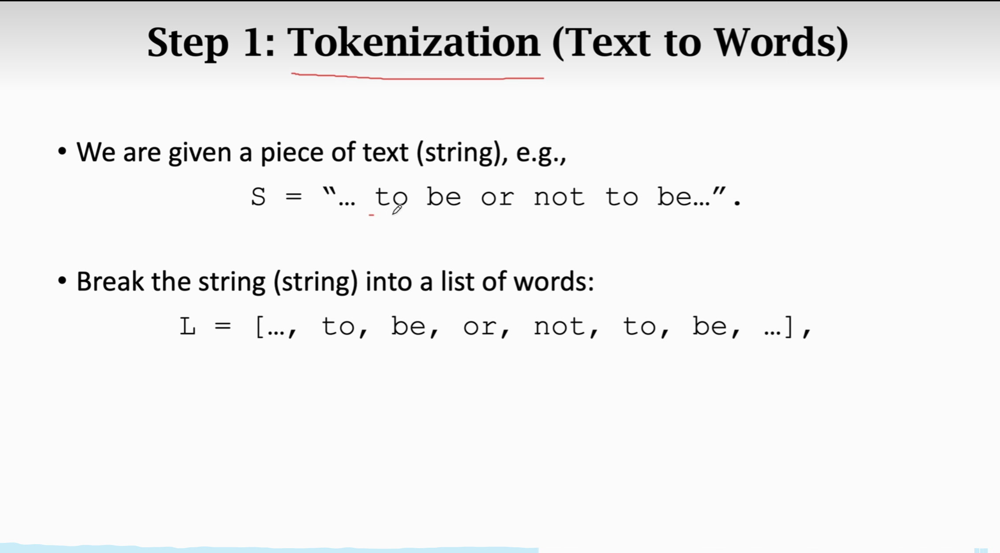
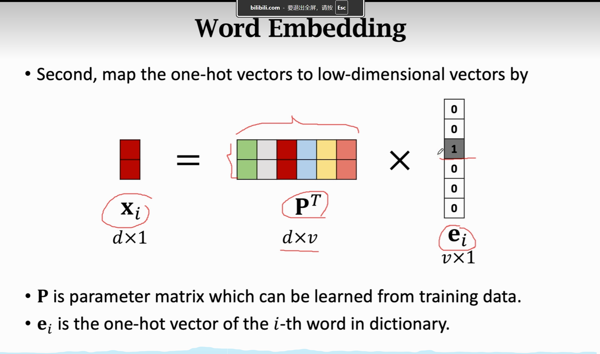

### 数据处理基础
为啥要用独热编码：

先Tokenization进行分词然后统计词频，然后排序之后按词频从大到小排列，可以选择提出频率低于某一阈值的词（可能为拼写错误），之后按序给出index，后将其原文转换成其对应的index，若没有则置为0或不置数。

#### 文本处理与词嵌入
1. 进行tokenization，可能要考虑大小写，the这类的词以及拼写错误等。
2. 构建字典，将词对应为一个正整数
3. 将话转为数组序列，然后One-Hot Encoding.
4. 序列对齐，固定长度为w，长的截掉，短的补0
5. word embedding降维

 6.   