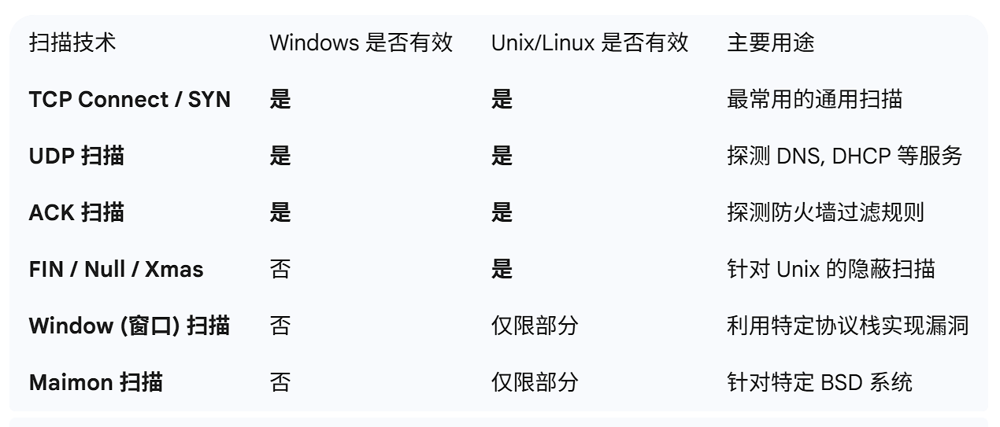

# 第一章
## 安全服务包括哪五种
### 1. 认证服务 (Authentication Service)

认证服务是安全的第一道防线，用于**核实实体（人、进程或设备）的身份**。

- **核心目的：** 确保“你就是你所声称的那个人”。
    
- **应用场景：** 用户登录系统、服务器证书验证（HTTPS）。
    
- **实现手段：** 密码、生物识别（指纹/人脸）、数字签名、数字证书。
    

### 2. 访问控制服务 (Access Control Service)

在认证身份后，访问控制决定了该身份**拥有哪些权限**，防止对资源的非授权使用。

- **核心目的：** 限制合法用户只能操作其权限范围内的资源。
    
- **应用场景：** 员工只能查看所属部门的文件；普通用户不能进入管理员后台。
    
- **实现手段：** 访问控制列表 (ACL)、基于角色的访问控制 (RBAC)。
    

### 3. 机密性服务 (Confidentiality Service)

机密性服务保护信息不被泄露给非授权的个人或实体。

- **核心目的：** 即使数据被窃听或截获，攻击者也无法读懂内容。
    
- **应用场景：** 网银转账信息加密、VPN 隧道传输。
    
- **实现手段：** 对称加密（如 AES）、非对称加密（如 RSA）。
    

### 4. 完整性服务 (Integrity Service)

完整性服务确保信息在传输或存储过程中**未被未经授权地篡改、删除或插入**。

- **核心目的：** 确保接收到的数据与发送时完全一致。
    
- **应用场景：** 软件下载时的校验码、电子合同的内容防篡改。
    
- **实现手段：** 散列函数（Hash）、消息认证码 (MAC)、数字签名。
    

### 5. 不可否认性服务 (Non-repudiation Service)

也称为**抗抵赖服务**，它通过提供证据来解决通信双方可能发生的抵赖争议。

- **核心目的：** 防止发送方否认发送过信息，或接收方否认收到过信息。
    
- **应用场景：** 电子商务交易记录、法律文件的电子签名。
    
- **实现手段：** 数字签名、受信任的第三方公证（CA）。

## 黑客攻击流程
### 第一阶段：踩点 (Footprinting / Reconnaissance)

这是攻击的准备阶段，目的是尽可能多地搜集目标的信息，而**不与目标系统产生直接交互**（被动踩点）或仅进行极少量的交互（主动踩点）。

- **目标：** 获取域名、IP 地址段、网络拓扑、员工信息、地理位置、甚至所使用的技术栈（如 Web 服务器版本）。
    
- **常用手段：**
    
    - **WHOIS 查询：** 获取域名注册信息。
        
    - **OSINT (开源情报)：** 通过搜索引擎（Google Hacking）、社交媒体（LinkedIn）寻找内部员工邮箱或技术讨论。
        
    - **DNS 记录查询：** 寻找子域名和邮件服务器地址。
        

### 第二阶段：扫描 (Scanning)

在有了初步的 IP 地址和域名后，黑客会利用工具探测目标网络中存活的主机及其开放的“大门”。

- **目标：** 发现存活主机、开放端口、正在运行的服务。
    
- **关键技术：**
    
    - **主机发现：** 使用 Ping 或 ARP 请求确认哪些 IP 是在线的。
        
    - **端口扫描：** 探测目标主机开放了哪些端口（如 80, 443, 3306）。
        
- **常用工具：** `Nmap`, `Masscan`。
    

### 第三阶段：查点 (Enumeration)

查点是扫描的深入，黑客会与目标端口建立**主动连接**，以获取更具体、更具破坏性的细节。

- **目标：** 获取操作系统的具体版本、服务程序的详细版本（Banner 抓取）、用户帐户名、共享目录、路由表等。
    
- **常见操作：**
    
    - **SNMP 查点：** 获取网络设备的配置信息。
        
    - **SMB 查点：** 寻找 Windows 系统的共享资源和空连接漏洞。
        
    - **HTTP 指纹识别：** 确定后端使用的是 PHP、Java 还是 Python。
        

### 第四阶段：攻击实施 (Gaining Access / Exploitation)

这是真正的“入侵”时刻。黑客利用前三个阶段搜集的漏洞信息（如弱口令、未修复的系统补丁、代码逻辑漏洞）执行攻击。

- **目标：** 获取系统控制权（Shell）、窃取敏感数据或提权。
    
- **攻击手段：**
    
    - **漏洞利用：** 使用溢出代码或 SQL 注入。
        
    - **社会工程学：** 钓鱼邮件诱导用户运行恶意程序。
        
    - **暴力破解：** 针对弱口令进行穷举。
        
- **常用工具：** `Metasploit`, `Burp Suite`, `SQLmap`。
    

### 第五阶段：攻击善后 (Post-Exploitation & Covering Tracks)

成功进入系统后，黑客需要确保能够长期潜伏（维持访问），并消除自己留下的痕迹。

- **维持访问 (Maintaining Access)：**
    
    - 安装**后门 (Backdoor)** 或 **Rootkit**。
        
    - 创建新的管理员账户。
        
- **攻击善后/清理痕迹 (Covering Tracks)：**
    
    - **删除日志：** 清除系统日志（Event Logs）、Web 访问日志。
        
    - **伪装工具：** 改变上传文件的修改时间，使其看起来像系统自带文件。
        
    - **清理工具：** 卸载攻击时使用的扫描器和脚本。

## 渗透测试流程
### 1. 前期交互 (Pre-engagement Interactions)

这是渗透测试的“法律保障”阶段。测试团队与客户进行正式沟通，明确测试的边界。

- **核心任务：** 确定测试范围（哪些 IP 或域名可以测）、测试时间、沟通渠道以及**免责声明**。
    
- **产出：** 签署正式的服务合同（SOW）和授权书。
    

### 2. 情报收集 (Intelligence Gathering)

这对应于之前提到的“踩点”。通过各种手段搜集目标的信息。

- **技术手段：** 利用公开渠道搜集目标的企业信息、网络资产、员工邮箱等。
    
- **分类：** * **被动收集：** 不触碰目标系统（如利用搜索引擎）。
    
    - **主动收集：** 与目标直接交互（如端口扫描）。
        

### 3. 威胁建模 (Threat Modeling)

这是渗透测试中**最体现逻辑**的一步。测试者站在攻击者的角度，分析目标最可能受到攻击的薄弱点。

- **核心任务：** 分析目标的业务流程，确定哪些资产最值钱（如数据库），并设计最可能的攻击路径。
    
- **目的：** 确保后续的漏洞扫描和利用更具针对性。
    

### 4. 漏洞分析 (Vulnerability Analysis)

在这一阶段，测试者将情报收集到的信息与已知的漏洞库进行比对，寻找进入系统的“钥匙”。

- **核心任务：** 发现系统、应用程序或配置中的缺陷。
    
- **方法：** * **自动扫描：** 使用 Nessus 或 OpenVAS 等工具。
    
    - **手动分析：** 人工验证扫描结果，排除误报，寻找逻辑漏洞。
        

### 5. 漏洞利用 (Exploitation)

这是整个测试的核心，旨在通过已发现的漏洞获取系统的控制权。

- **核心原则：** 必须在**受控且安全**的前提下进行，尽量不影响业务的正常运行。
    
- **常见动作：** 执行溢出脚本、注入 SQL 指令、破解弱口令。
    

### 6. 后渗透攻击 (Post-Exploitation)

进入系统后，评估该漏洞对业务可能造成的**实际影响力**。

- **核心任务：** * **横向移动：** 从已控制的主机转向内网其他更有价值的主机。
    
    - **权限提升：** 从普通用户权限提升至管理员权限（Root/Admin）。
        
    - **敏感数据提取：** 证明数据确实可以被窃取。
        

### 7. 报告 (Reporting)

这是渗透测试**最有价值**的产出，决定了测试的成败。

- **核心内容：**
    
    - **执行摘要：** 给管理层看的，说明整体安全态势。
        
    - **技术细节：** 给开发/运维看的，包括漏洞描述、复现步骤、截图。
        
    - **修复建议：** 针对每个发现的漏洞提供具体的加固方案。

## 端口扫描技术
### 1. TCP 连接扫描 (TCP Connect Scan)

这是最基础的扫描方式，利用操作系统的 `connect()` 系统调用。

- **原理：** 与目标端口完成完整的 **TCP 三次握手**。
    
- **结果：** * 收到 `SYN/ACK`：端口开放。
    
    - 收到 `RST`：端口关闭。
        
- **优点：** 准确度高，不需要特殊权限（普通用户即可执行）。
    
- **缺点：** 极易被防火墙或 IDS（入侵检测系统）记录，因为完整的连接会留下日志。
    

### 2. TCP SYN 扫描 (半开放扫描)

这是最流行的扫描方式，也是 Nmap 的默认选项（`-sS`）。

- **原理：** 只进行三次握手的前两步。发送 `SYN`，如果收到 `SYN/ACK`，则立即发送 `RST` 断开连接，而不发送最后的 `ACK`。
    
- **结果：** * 收到 `SYN/ACK`：端口开放。
    
    - 收到 `RST`：端口关闭。
        
- **优点：** 速度快，相对隐蔽（因为连接未真正建立，应用层通常不会记录日志）。
    

---

### 3. 隐蔽扫描 (TCP FIN, Null, Xmas 扫描)

这类扫描利用了 RFC 793 的一个特性：发送一个不包含 `SYN`、`RST` 或 `ACK` 标志的数据包。

- **TCP FIN 扫描：** 只发送 `FIN` 标志位。
    
- **原理：** * **关闭的端口：** 根据 RFC，应该返回一个 `RST` 包。
    
    - **开放的端口：** 应该忽略该包（不响应）。
        
- **优点：** 能绕过一些简单的包过滤防火墙。
    
- **缺点：** 在 Windows 系统上无效（Windows 不论端口开闭都会返回 `RST`），主要针对类 Unix 系统。
    

### 4. TCP ACK 扫描

这种扫描不用于确定端口是否开放，而是用于**探测防火墙规则**。

- **原理：** 发送一个仅设置 `ACK` 位的数据包。
    
- **结果：** * 收到 `RST`：说明数据包通过了防火墙，端口未被过滤。
    
    - 无响应/收到 ICMP 错误：说明端口被防火墙拦截（Filtered）。
        

---

### 5. TCP 窗口扫描 (TCP Window Scan)

类似于 ACK 扫描，但它会检查返回的 `RST` 包中的 **TCP 窗口大小** 字段。

- **原理：** 在某些操作系统（如 AIX、FreeBSD）中，开放端口返回的 `RST` 包窗口大小为正数，关闭端口返回的为零。
    
- **局限性：** 极度依赖特定的系统实现，适用范围较窄。
    

### 6. TCP Maimon 扫描

由安全专家 Uriel Maimon 发现，类似于 FIN 扫描。

- **原理：** 发送 `FIN/ACK` 标志位。
    
- **预期：** 依据 RFC，无论端口开闭都应返回 `RST`。但在某些 BSD 系统中，如果端口开放，则不会响应。
    

---

### 7. UDP 扫描 (UDP Scan)

由于 UDP 是无连接协议，扫描难度比 TCP 大得多。

- **原理：** 向目标发送一个 UDP 包（通常不含有效载荷）。
    
- **结果判断：**
    
    - **无响应：** 可能是端口开放，也可能是被防火墙过滤。
        
    - **收到 ICMP 端口不可达错误：** 明确表示端口关闭。
        
    - **收到 UDP 响应：** 明确表示端口开放（极少见）。
        
- **缺点：** 速度极慢，且结果极其不可靠。
- 
- 

## 